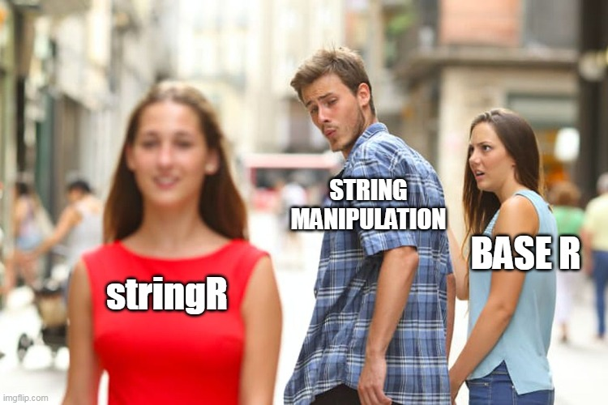

```{r setup, include=FALSE}
knitr::opts_chunk$set(echo = TRUE)
```
***
<center>
{width=350px}
</center>

<br>
Strings! Numeric value's unruly, difficult, unpopular cousin? We think not! String values play not only an important role in data cleaning, but texts itself are increasingly treated as rich sources of data for research in political science and public policy (see here, for example https://journals.sagepub.com/doi/full/10.1177/20531680211022206, or here: https://onlinelibrary.wiley.com/doi/10.1111/padm.12656). So today, we want to dive deeper into how to manipulate strings using the stringR package. 
<br>

<center>
{width=350px}
</center>


## A Brief Overview
<br>
Most of us already became somewhat familiar with the basic functionality of the stringR package when we used it for the previous assignments. Part of the tidyverse, the stringR package was published in 2019 and is currently running version 1.4.0. <b> All functions in stringr start with "str_" and the first argument within the bracket is always the vector of strings that you want to modify, e.g. str_replace(<i>argument1</i>, ...) which comes in handy when using the the pipe to write your code. </b>
<br>

## Session content
In the following document, we want to walk you through the following key functions of the stringR package  and some applications:

* Scraping data from the Guardian website
* Splitting, subsetting and joining strings
* Managing length and order of strings
* Manipulating and mutating strings


## Demonstration

### Scraping data from the Guardian website

First, let's load the necessary packages we'll need for this exercise:
```{r include = TRUE}
library(tidyverse)
library(stringr)
library(xml2)
```

For the purpose of this workshops we will be working with a tried and trusted data source: newspaper headlines! Thanks to the folks at the Internet Archive (https://archive.org), we will look at newspaper headlines across different points in time. Below, we can see the link to the Guardian headlines from the first day of classes, September 1, 2021.

```{r}
guardian_url <- "https://web.archive.org/web/20210901040912/https://www.theguardian.com/international"
```

Let's extract the newspaper headlines from that day.

```{r}
guardian_headlines <- guardian_url %>% read_html() %>% 
rvest::html_nodes(xpath = '//a[contains(concat( " ", @class, " " ), concat( " ", "js-headline-text", " " ))]') %>% rvest::html_text()
guardian_headlines[c(1:5)]
```

### Splitting, subsetting and joining strings

Nice! What if we wanted to access the headlines of the following day?
Let's take a moment and think about the logic behind the URL:
<br>
https://web.archive.org/web/20210901040912/https://www.theguardian.com/international
<br>
We have the Internet Archive ".../web" followed by a time stamp, and the URL of our news source. Let's split up the string with str_split into the base part of the url which we call url_archive and the changing part of the url including the date and news source. str_split splits the string into substrings where the splitting pattern occurs and returns a list of substrings. Here we want to split after "web/", so let us make this our splitting pattern.

```{r include=TRUE}
guardian_split <- guardian_url %>% str_split(pattern = "web/") 
guardian_split
```
We can then store the base part and changing part into into separate strings.
```{r include=TRUE}
url_archive <- guardian_split[[1]][1]
url_date <- guardian_split[[1]][2]
url_archive
url_date
```

We can see that the first four digits are the year, followed by two digits for the month, two for the day, and the remaining 6 for the time of day at which the information was collected (we can disregard the time of day for now). 

Using the str_sub command, specifying the start and end position in the string, we subset year, month, and day. (Negative indexing is also possible.)

```{r}
url_year <- url_date %>% str_sub(start = 1, end = 4) 
url_month <- url_date %>% str_sub(start = 5, end = 6) 
url_day <- url_date %>% str_sub(start = 7, end = 8) 

url_year
url_month
url_day
```

If we wanted to replace the information about year, month, or day, we could use the str_sub or str_replace function and assign a new value to the positions in the URL.

```{r}
str_sub(url_date, start = 7, end = 8) <- '02'
url_date
url_date2 <- str_replace(url_date, "01", "02")
url_date2
```

Now that we have changed the day of the URL to September 2, 2021 we are merging the two substrings again.We can use str_c for this. Keep in mind that earlier, we separated the URL at 'web/', so we need to add this again to receive a working URL.

```{r}
new_url <- str_c(url_archive, url_date, sep = "web/")
new_url

```

With our new URL, we can now scrape the headlines for the next day's edition of the Guardian newspaper!

```{r}
guardian_headlines_new <- new_url %>% read_html() %>% 
rvest::html_nodes(xpath = '//a[contains(concat( " ", @class, " " ), concat( " ", "js-headline-text", " " ))]') %>% rvest::html_text()
guardian_headlines_new[c(1:5)]
```

### Managing length and order of strings
Now that we now how to retrieve headlines, let us have a look at the headlines we got for 1 September. First, we might be interested to order them alphabetically. We can use str_sort for this.

```{r}
str_sort(guardian_headlines)
```
Did you realise that there are two headlines at the beginning that start with a whitespace and are therefore mistakenly ranked first? We can trim whitespace at the beginning and end of each string using str_trunc. Furthermore, let us truncate the strings to make the output neater using str_trunc. This gives us a nicely sorted list.

```{r}
str_sort(str_trunc(str_trim(guardian_headlines),17))
```

If we want to know which numeric rank the headlines in the list will have if sorted, we use str_order.

```{r}
str_order(str_trim(guardian_headlines))
```
Finally, we might also be interested in finding out how many characters each headline has. We can use str_length for this.
```{r}
str_length(guardian_headlines)
```

### Manipulating and mutating strings

Next, we want to process the headlines, so that we can analyse the words in the headlines properly. First we want to make sure that our list of headlines does not include duplicates. We can eliminate duplicates with "unique". FYI: If we wanted to duplicate strings we can use str_dup, specifying the number of repetition in the second argument

```{r}
guardian_headlines <- unique(guardian_headlines)
headlines_triple <- str_dup(guardian_headlines[1], times = 3)
headlines_triple
```

Second, we want to collapse all headlines into a single string for which we use str_flatten. Note, we are the second argument is the pattern that will be placed between the strings. In our case we want a space, so we specify " ".

```{r}
headline_text <- str_flatten(guardian_headlines, " ")
headline_text
```
Nice! However, there are still punctuations and too many spaces in the text. Let us eliminate all punctuations at once using str_replace_all. The Regex term [:punct:] recognises all punctuation signs which eliminates the need of specifying dots, exclamation marks etc. separately. Similarily [:space:] refers to all lign change, tabs and spaces. Alternatively, we can use str_squish here. Compare the results.

```{r}
headline_text <- str_replace_all(headline_text, "[:punct:]", "")
headline_text <- str_replace_all(headline_text, "[:space:]", " ")
headline_text2 <- str_squish(headline_text)
headline_text
headline_text2
```
This looks far better, however, we still have the problem that some words are capitalised because they used to be the first word in the headline. We can convert strings to lower case using str_to_lower. For commands to capitalise strings and convert them to title case, have a look at the cheat sheet.
```{r}
headline_text <- str_to_lower(headline_text)
headline_text
```
Nice!! Now we are ready to analyse the words. Let us say we are interested in finding out the most frequent noun used in the headlines. Following https://r4ds.had.co.nz/strings.html, while imperfect, we could define a noun as a word proceeded by either "the" or "a". Using this imperfect definition, we can use either str_match_all or str_extract_all to extract all the nouns from the text.

```{r}
noun_function <- "(a|the) ([^ ]+)"
extracted_words <- str_extract_all(headline_text, noun_function)
extracted_words2 <- str_match_all(headline_text, noun_function)
extracted_words
extracted_words2
```
The convenience of str_match is that it saves each individual word separately in a column too. This way we can save the nouns to a new vector and use this list to find the five most frequently used nouns.

```{r}
nouns <- extracted_words2[[1]][,3]

top5words <- tibble(nouns)%>%
  count(nouns) %>% 
  arrange(desc(n))%>%
  head(5)

top5words
```

## Small Assignments for Further Practice

1. Scrape the newspaper articles on the date of your most recent birthday. What were the most common nouns?

2. Compare two or more of the following news outlets' headlines. Which one has the longest average headlines on that day?
  + https://www.foxnews.com/(https://web.archive.org/web/20211027054620/https://www.foxnews.com/)
  + https://www.bbc.com/(https://web.archive.org/web/20211026203835/https://www.bbc.com/)
  + https://www.dailymail.co.uk/home/index.html(https://web.archive.org/web/20211027065717/https://www.dailymail.co.uk/home/index.html)
  


