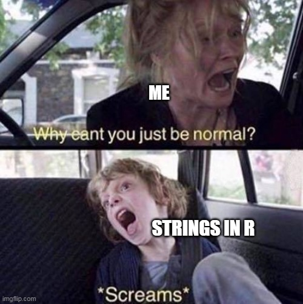

```{r setup, include=FALSE}
knitr::opts_chunk$set(echo = TRUE)
```

### String Manipulation using stringR



Strings! Numeric value's unruly, difficult, unpopular cousin? We think not! String values play not only an important role in data cleaning, but texts itself are increasingly treated as rich sources of data for research in political science and public policy (see here, for example https://journals.sagepub.com/doi/full/10.1177/20531680211022206, or here: https://onlinelibrary.wiley.com/doi/10.1111/padm.12656). So today, we want to dive deeper into how to basics of manipulating strings using the stringR package. 

Here is an overview of the topics and functions of the stringR package we want to introduce you to:
x <- c("abcdef", "ghifjk")

Subsetting Strings
Mutating Strings
String ordering and sorting
Join and Split
Order Strings


library(stringr)
library(xml2)

https://web.archive.org/web/20211020053923/https://www.nytimes.com/
  


First, let's load the necessary packages:
```{r include = TRUE}
install.packages("stringr")
library(stringr)
```

